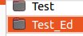

# Start the MiniConda container

**UNDER DEVELOPMENT**

*Unfortunately, every time you will have to start the MiniConda container. However, the first time you need to retrieve the Jupyter API-key. When we login the the key we will see the content of the ~/Test/notebooks directory. The jupyter directtory called notebooks will be created for you.*

**content**

```@contents
Pages = ["chapter3.md"]
```

## Prerequisites

A PC or laptop running Ubuntu 22.04 with Git installed is required.

## What tou will do

Step 1: Create a directory ~/Test, where you create the file `compose.yml`.

Step 2: Create a directory ~/Test_Ed, where you clone Ed's repository.

Step 3: Get the Jupyter API-key

Step 4: Open a Notebook.


## compose.yml

```
version: "3.9" # Use the latest version of the Docker Compose file format

services:
  jupyter-notebook:
    image: continuumio/miniconda3
    ports:
      - "8888:8888"
    command: 
      - /bin/bash
      - "-c"
      - |
        conda install jupyter -y --quiet && \
        mkdir -p /opt/notebooks && \
        jupyter notebook \
          --notebook-dir=/opt/notebooks \
          --ip='*' \
          --port=8888 \
          --no-browser \
          --allow-root
    volumes:
      - ./notebooks:/opt/notebooks 
    tty: true
    stdin_open: true
```

## Step 1: Create a directory ~/Test, where you create the file `compose.yml`.

Docker will use the `comose.yml` file to create the MiniConda container. You can access this containeer with your browser on port 8888.

|Step        | Action      |
|:---------- | :---------- |
| 1 | Create `~/Test`: `mkdir ~/Test` |
| 2 | Goto the directory: `cd ~/Test` |
| 3 | Create the file: `nano compose.yml` |
| 4 | Go to the file compose.yml and click on the copy-symbol at the right-hand corner to copy the content to the clipboard. | 
| 5 | Paste the content into the file: `Ctrl+Shift+V`. |
| 6 | Create the container: `docker-compose -f compose.yml -d`. |
| 7 | Display the name of the container: `docker container ls`. |
||

## Step 2: Create a directory `~/Test_Ed`, and clone Ed Donner's repo.

You will need a copy of Ed Donner's repository, with the notebook files. A notebook file can be uploaded to the MiniConda container.

|Step        | Action      |
|:---------- | :---------- |
| 1 | Create the directory: `mkdir ~/test_Ed`. |
| 2 | Goto the directory: `cd ~/Test_Ed`. |
| 3 | Clone Ed's repository: `git clone https://github.com/ed-donner/llm_engineering.git`. |
||

## Step 3: Get the Jupyter API-key

You need the token the first time you login. To retrieve the token to copy the part after 'token=', with the command: `jupyther server list`.

|Step        | Action      |
|:---------- | :---------- |
| 1 | Start a container, make use of autocompletion with the tab-button after typing test: `docker start test_jupyter-notebook`. |
| 2 | Open a terminal and enter the container by typing: `docker exec -it test_jupyter-notebook_1 bash`. |
| 3 | Type: `jupyter server list`. ``\\``|
| 4 | Copy (Ctrl+Shift+C) and save the token in a save place. |
| 5 | You also have to add the dotenv module: `pip3 install python-dotenv`. |
| 6 | And the OpenAI module: `pip3 install OpenAI`. |
| 7 | Exit the container: `Ctrl+D`. |
||

## Step 4: Open a Notebook.

|Step        | Action      |
|:---------- | :---------- |
| 1 | Start a container, make use of autocompletion with the tab-button as soon as you type `test`: `docker start test_jupyter-notebook`. |
| 2 | Connect to the container using the browser: `localhost:8888`. |
| 3 | Click on the Upload-button. ``\\`` |
| 4 | Select the `Test_Ed` folder, and open it: `Double click`. ``\\`` |
| 5 | Open the `llm_engineering` folder. ``\\`` |
| 6 | Open the `week1` folder. ``\\`` |
| 7 | Select the `day1.ipynb` file. Load the file: `double click`, and save the file: `Ctrl+S`. |
| 8 | Now you can work with the Notebook file. |
| 10 | Load the other Notebooks of week1. When you look at `ls ~/Test/notebooks` you will see the uploaded files.  Actually, the same as you see in the browser. ``\\````\\``*What you will see in the browser* |
||

My experience is that I only have to enter the Jupter-key once! When I connect to the container I allways get an overview of the Notebooks I uploaded.

## Some Docker commands
| Command      | Comment |
| :---------- |  :---------- |
| docker container ls | list al running (active) containers. |
| docker container ls -a | List all the containers (also the not running ones). In the first column shows the id's of the containers. |
| docker container rm test_jupyter-notebook_1 | Delete a container. |
| docker container rm ef6f974a579f | Delete a container by its id. |
| docker image ls | List all repositories (images). |
| docker exec -it <container name or id> /bin/bash | Enter a container. |
||

We are not finished yet. To work with ChatGPT you first have to put its API-key in a file named: `.env`.

## Summary

The chapter describes the process of starting a MiniConda container, specifically for working with Jupyter notebooks. It begins by stating that users must start the MiniConda container each time they want to work, but highlights that the Jupyter API key needs to be retrieved only during the initial login. Upon logging in with the key, users will gain access to the contents of the ~/Test/notebooks directory.